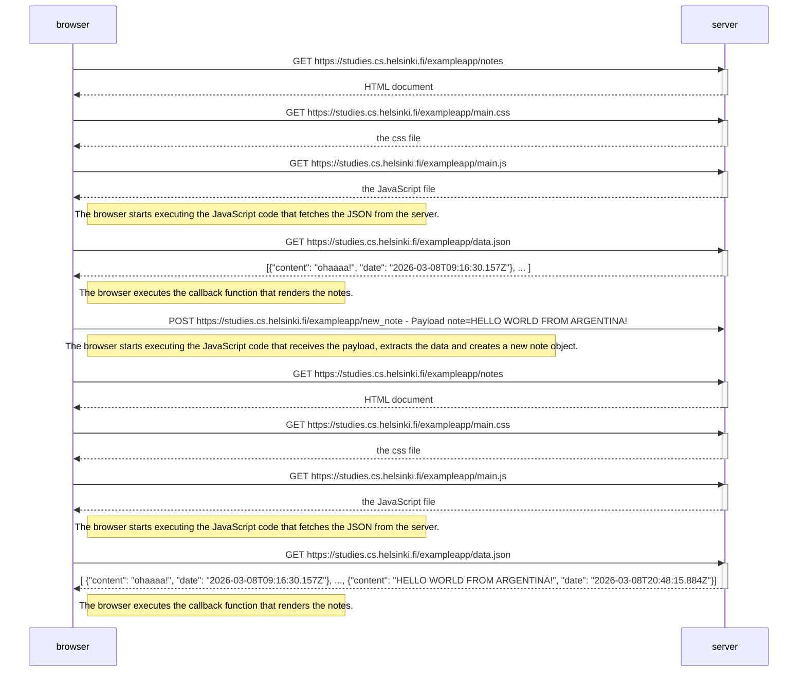

```mermaid
sequenceDiagram
    participant browser
    participant server

    browser->>server: GET https://studies.cs.helsinki.fi/exampleapp/notes
    activate server
    server-->>browser: HTML document
    deactivate server

    browser->>server: GET https://studies.cs.helsinki.fi/exampleapp/main.css
    activate server
    server-->>browser: the css file
    deactivate server

    browser->>server: GET https://studies.cs.helsinki.fi/exampleapp/main.js
    activate server
    server-->>browser: the JavaScript file
    deactivate server

    Note right of browser: The browser starts executing the JavaScript code that fetches the JSON from the server.

    browser->>server: GET https://studies.cs.helsinki.fi/exampleapp/data.json
    activate server
    server-->>browser: [{"content": "ohaaaa!", "date": "2026-03-08T09:16:30.157Z"}, ... ]
    deactivate server

    Note right of browser: The browser executes the callback function that renders the notes.

    browser->>server: POST https://studies.cs.helsinki.fi/exampleapp/new_note - Payload note=HELLO WORLD FROM ARGENTINA!
    
    Note right of browser: The browser starts executing the JavaScript code that receives the payload, extracts the data and creates a new note object.

    browser->>server: GET https://studies.cs.helsinki.fi/exampleapp/notes
    activate server
    server-->>browser: HTML document
    deactivate server

    browser->>server: GET https://studies.cs.helsinki.fi/exampleapp/main.css
    activate server
    server-->>browser: the css file
    deactivate server

    browser->>server: GET https://studies.cs.helsinki.fi/exampleapp/main.js
    activate server
    server-->>browser: the JavaScript file
    deactivate server

    Note right of browser: The browser starts executing the JavaScript code that fetches the JSON from the server.

    browser->>server: GET https://studies.cs.helsinki.fi/exampleapp/data.json
    activate server
    server-->>browser: [ {"content": "ohaaaa!", "date": "2026-03-08T09:16:30.157Z"}, ..., {"content": "HELLO WORLD FROM ARGENTINA!", "date": "2026-03-08T20:48:15.884Z"}]
    deactivate server

    Note right of browser: The browser executes the callback function that renders the notes.
```
